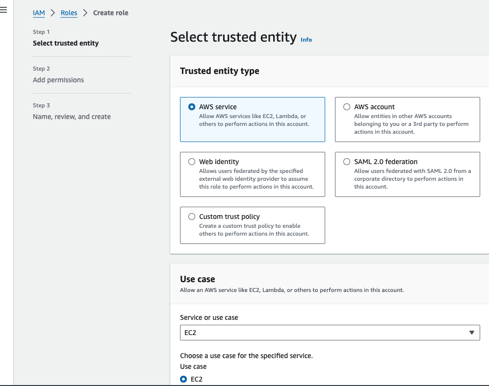
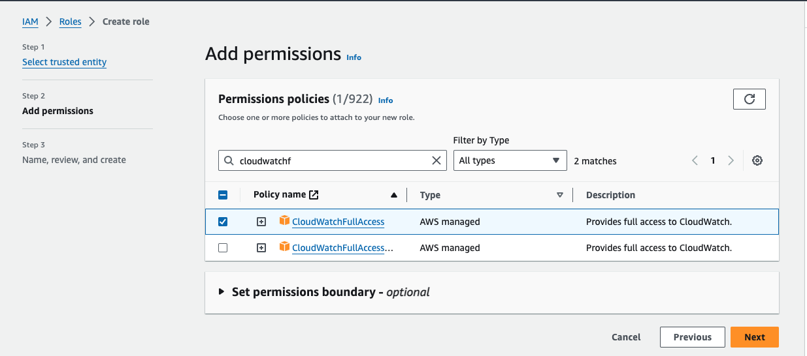
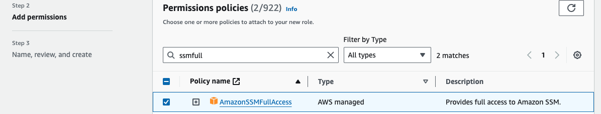
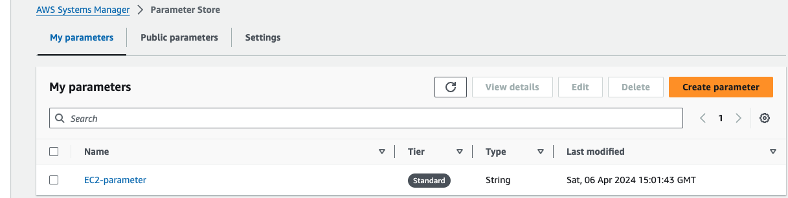
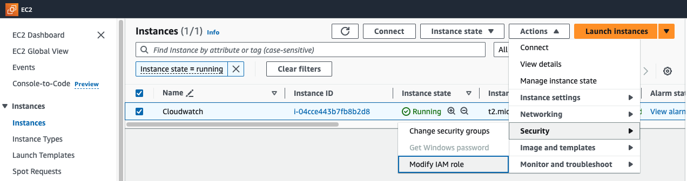
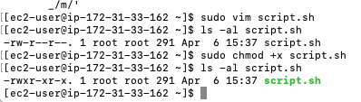

# Monitoring-EC2-Servers-with-CloudWatch-and-Cloudtrail

Monitoring the state of your servers and the processes running on them is crucial to optimize settings, correct errors, or respond to increased load in time before your users notice degraded performance. It is essential for maintaining the health, performance, and availability of your infrastructure to ensure that these systems operate effectively, efficiently, and securely, while also detecting and addressing any issues or anomalies in a timely manner. AWS CloudWatch offers a comprehensive set of monitoring and alerting tools that allow you to monitor various metrics and set up automated actions based on predefined thresholds.

Before we dive into monitoring AWS EC2 instances using CloudWatch, let's take a moment to understand CloudWatch Metrics and Alarms.

CloudWatch Metrics: Think of CloudWatch Metrics as the eyes and ears of your AWS resources. These metrics collect data about the performance of various AWS resources, like EC2 instances and databases. Metrics cover a wide range of dimensions, such as CPU utilization, network throughput, disk I/O, and error rates, allowing for comprehensive monitoring and analysis of resource behavior over time.

Alarms: Now, CloudWatch Alarms complement metrics by enabling proactive monitoring and alerting based on predefined thresholds. They keep an eye on your CloudWatch Metrics and raise the alarm when something's not right. You can set them up to notify you or take automated actions when certain metrics go beyond specific thresholds. For example, you could get an alert if CPU usage on your EC2 instance spikes unexpectedly.

## Prerequisites
Before you begin monitoring your EC2 instances with CloudWatch, make sure you have the following:

- An AWS account with access to CloudWatch and EC2 services
- Basic knowledge of AWS services

## Step 1: Create an IAM Role with CloudWatchFull Access and SSMFullAccess

Granting an IAM role with both CloudWatchFullAccess and SSMFullAccess permissions provides extensive monitoring and management capabilities for AWS resources.

CloudWatchFullAccess enables monitoring of metrics, setting up alarms, and logging across various AWS services. It allows you to track performance, detect anomalies, and receive notifications for potential issues.

SSMFullAccess complements CloudWatch by enabling action-taking based on CloudWatch metrics insights. It offers features like remote command execution, secure configuration management, and instance access without opening ports. These capabilities enhance operational automation and troubleshooting, ensuring efficient resource management.

Now, lets get to work.

1. navigate to the iam console then click on roles
2. Click on Create role then select ec2 service on select trusted entity then click on `next`



3. Add `CloudWatchFullAccess` and `SSMFullAccess` permission policy



4. Create Role

## Create A parameter in Systen Manager
1. Navigate to the AWS System Manager Console
2. In the AWS System Manager navigate menu under Application management, select parameter store
3. create a new parameter and paste the code snippet below
```
{
	"metrics": {
		"append_dimensions": {
			"InstanceId": "${aws:InstanceId}"
		},
		"metrics_collected": {
			"mem": {
				"measurement": [
					"mem_used_percent"
				],
				"metrics_collection_interval": 180
			},
            "disk": {
				"measurement": [
                     "disk_used_percent"
				],
				"metrics_collection_interval": 180
			}
		}
	}
}
```

The configuration file provided above outlines the metrics to be collected by the CloudWatch agent from an EC2 instance.  Here's a breakdown of what each part does:

The "metrics" section defines the types of metrics that will be collected. Within this section:

The "append_dimensions" subsection specifies additional dimensions to be included with the collected metrics. In this instance, it adds the instance ID as a dimension using the placeholder ${aws:InstanceId}.
The "metrics_collected" section further details the metrics to be gathered. It includes:

Configuration for memory-related metrics under "mem". This includes specifying the metric "mem_used_percent" to track memory usage percentage.
Setting the interval for collecting these metrics to every 180 seconds (or 3 minutes).
Similarly, disk-related metrics are configured under "disk". This includes:

Specifying the metric "disk_used_percent" to monitor disk usage percentage.
Setting the collection interval to 180 seconds, mirroring the frequency of memory metric collection.

## Create an EC2 instance and attach the role created in Step 1
After successfully setting up an IAM Role and creating a parameter within the AWS Systems Manager Console, our next step is to launch an EC2 instance and associate it with the previously created roles. It's important to highlight that the Systems Manager (SSM) will possess access to the parameter we generated. By attaching the role to the EC2 instance, it will also inherit access to these parameters."

1. go to the EC2 console and select 'Instances.' Then, click on 'Launch Instance' located at the top right corner.

2. Select the 'Amazon Linux 2' Amazon Machine Image (AMI) to launch the instance. During this process, ensure to attach the role created in the previous step


3. SSH into the instance, install CloudWatch agent. Create a file name script.sh and paste the shell script below
```bash
#!/bin/bash
wget https://s3.amazonaws.com/amazoncloudwatch-agent/linux/amd64/latest/AmazonCloudWatchAgent.zip
unzip AmazonCloudWatchAgent.zip
sudo ./install.sh
sudo /opt/aws/amazon-cloudwatch-agent/bin/amazon-cloudwatch-agent-ctl -a fetch-config -m ec2 -c ssm:/alarm/AWS-CWAgentLinConfig -s
```
make the file executable and run the file.



4. start the CloudWatch agent 
```bash
 sudo /opt/aws/amazon-cloudwatch-agent/bin/amazon-cloudwatch-agent-ctl -m ec2 -a start
```
5. Verify if CloudWatch is installed and running successfully
```bash
 sudo /opt/aws/amazon-cloudwatch-agent/bin/amazon-cloudwatch-agent-ctl -m ec2 -a status
```

